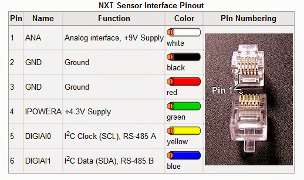

# VL53L1X sensor example

I modified the original example for the VL53L1X sensor. It works without the expansion board and 
uses STM's VL53L1X ULD driver. The original example can be obtained by downloading the [ULD driver from STM](https://www.st.com/en/embedded-software/stsw-img009.html).

# Hardware and Software environment
    
  - This example has been tested with STMicroelectronics STM32F401RE Nucleo boards
  
  - Connect a VL53L1X sensor to your board's I2C1 SDA and SCL. Tested with the Pololu sensor.

  - Compile and run in STM32CubeIDE or other IDE of your choice

# Sensor pinout

# EV3 Cable pinout
My sensor had this cable. I had to tear it apart to connect it to the NUCLEO board.

# How to use it ? 

In order to make the program work, you must do the following :
 - Open STM32CubeIDE toolchain
 - Rebuild all files and load your image into target memory
 - Open an Tera Term session (On Linux, `minicom` or `picocom`)
 - Select the right COM port (Linux: `minicom --device /dev/ttyACM0` or _ttyUSB0_)
 - Reset Nucleo board
 - Observe the distance measured on the Tera Term.
 - Full description in Documentation directory

 # Directory contents 

  - Src/main.c                  Main program 
  - Src/stm32f4xx_hal_msp.c     HAL MSP module for STM32F4xx
  - Src/stm32f4xx_it.c          Interrupt handlers for STM32F4xx 
  - Inc/stm32f4xx_hal_conf.h    HAL Configuration file for STM32F4xx
  - Inc/stm32f4xx_it.h          Interrupt handlers header file for STM32F4xx
  - Src/stm32l4xx_hal_msp.c     HAL MSP module for STM32L4xx
  - Src/stm32l4xx_it.c          Interrupt handlers for STM32L4xx 
  - Inc/stm32l4xx_hal_conf.h    HAL Configuration file for STM32L4xx
  - Inc/stm32l4xx_it.h          Interrupt handlers header file for STM32L4xx  
  - Inc/stm32xxx_hal.h          Generic HAL selector
 